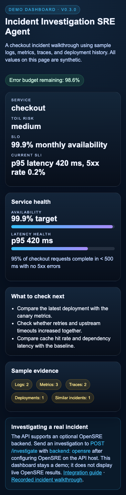
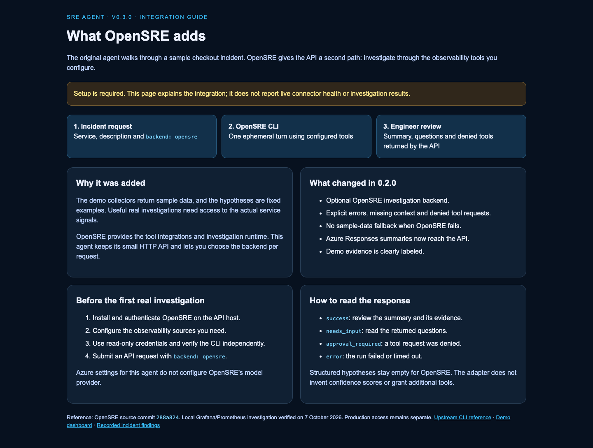
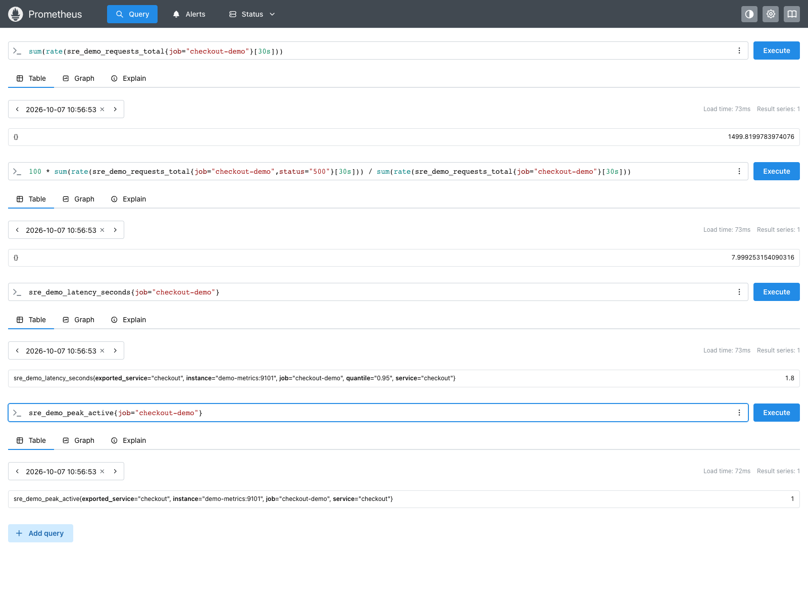

# Incident Investigation SRE Agent

A small incident investigation API with a sample dashboard and an optional
[OpenSRE](https://github.com/Tracer-Cloud/opensre) backend. Use the demo to walk
through a checkout incident, or connect OpenSRE to investigate with your own
observability tools.

**Current code version: 0.3.0.** Python 3.11 or later is required. This version
adds a recorded overload case study, backend-aware plans and investigation notes. It has not been
published as a package release. See the [changelog](CHANGELOG.md).

## Proof of work: checkout overload

[Read the complete incident report](docs/case-studies/checkout-overload/README.md) ·
[Setup and replay](docs/GRAFANA_PROMETHEUS_QUICKSTART.md) ·
[Documentation index](docs/index.md) · [Version history](CHANGELOG.md)

A recorded local run follows peak traffic and rising P95 through Prometheus,
Grafana, the API, OpenSRE and Azure. It includes the agent's actual response,
failed and successful attempts, proposed fixes, and baseline/recovery checks.
The workload is synthetic; queries and model calls are real. Recovery is
scripted by the exporter, not executed by the agent.


## What works today

| Mode | Evidence | Result |
| --- | --- | --- |
| Demo, the default | Synthetic logs, metrics, traces, deployments and incident history | Two illustrative hypotheses and suggested checks |
| OpenSRE, opt-in | Tools configured in your OpenSRE installation | An investigation summary, questions and any denied tool requests |
| Optional OpenAI or Azure reasoning | A compact sample of the demo evidence | A model-written summary alongside the illustrative hypotheses |

The demo is useful for learning and local walkthroughs. Its hypotheses are
fixed examples, and its confidence scores are not calibrated probabilities.
For real investigations, configure OpenSRE and select it in the API request.
The [OpenSRE integration guide](docs/OPENSRE_INTEGRATION.md) explains what changed and why.
The [assessment](docs/ASSESSMENT.md) explains what was reviewed and what still
needs work before a production deployment.

## Dashboard preview

These screenshots show the **v0.3.0 demo dashboard**. The values are synthetic;
the dashboard does not display live OpenSRE investigations.


<details>
<summary>Mobile preview</summary>



</details>

## OpenSRE integration dashboard

Open http://127.0.0.1:8001/integration after starting the dashboard. This page
explains the new backend, setup and response statuses; it is not a live health monitor.



## Run locally

Run these commands from the repository root:

```bash
python3 -m venv .venv
source .venv/bin/activate
pip install -e '.[test]'
uvicorn app.main:app --reload
```

The API docs are at http://127.0.0.1:8000/docs. In another terminal with the
same virtual environment active, start the sample dashboard:

```bash
python examples/dashboard_app.py
```

Open http://127.0.0.1:8001/. Both demo paths work without model credentials.

```bash
curl http://127.0.0.1:8000/investigate \
  -H 'Content-Type: application/json' \
  -d '{"service":"checkout","description":"Latency increased after the latest release","backend":"demo"}'
```

`GET /health` reports the service status and code version.

## Use OpenSRE

Install OpenSRE using its [official setup instructions](https://github.com/Tracer-Cloud/opensre).
Authenticate its model provider and configure the observability integrations
you need. Use read-only credentials for investigation.

OpenSRE must be available on the same host as this API. Check it independently:

```bash
opensre --json ask --ephemeral "Summarize configured observability sources without changing state"
```

Then send a request to the agent:

```bash
curl http://127.0.0.1:8000/investigate \
  -H 'Content-Type: application/json' \
  -d '{"service":"checkout","description":"P95 latency rose after the latest release. Investigate the last hour.","backend":"opensre"}'
```

Findings appear in `summary`. The `hypotheses` array stays empty because
OpenSRE's CLI does not promise this project's structured hypothesis format.
The adapter does not turn prose into invented confidence scores.

| Response status | Meaning |
| --- | --- |
| `success` | OpenSRE completed the turn; review its findings and evidence |
| `needs_input` | More context is needed; read `questions` |
| `approval_required` | A tool request was denied; read `denied_tools` |
| `error` | The run failed, timed out or returned invalid output |

Incomplete runs set `safe_to_continue=false`. Failed runs never substitute
sample evidence. Calls are ephemeral, so follow-up context requires a new
request. Use OpenSRE directly for session resumption or tool approvals.

The adapter grants no additional tools and disables OpenSRE telemetry and
prompt logging for its calls. OpenSRE's tool declarations and credential
permissions still determine what it can access.

| Setting | Default | Purpose |
| --- | --- | --- |
| `OPENSRE_BINARY` | `opensre` | Executable name or absolute path |
| `OPENSRE_TIMEOUT_SECONDS` | `120` | Maximum wait for an OpenSRE process |

Integration was checked against OpenSRE source commit
[`288a824`](https://github.com/Tracer-Cloud/opensre/tree/288a82456af27ce75487527b2b21c7ab1cbf5d6b).
OpenSRE is in public alpha; this is a source reference, not a guarantee of
compatibility with every later build. Its model authentication is separate
from the Azure/OpenAI settings below.

## Optional model summary

This option adds a model summary to the **demo backend**. It does not replace
sample evidence with live telemetry or configure OpenSRE.

Copy `.env.example` to an ignored `.env` file. For the supplied Azure Foundry
deployment, set:

```dotenv
LLM_PROVIDER=azure
LLM_MODEL=gpt-5.4
AZURE_OPENAI_RESPONSES_URL=https://soloai-v0-resource.cognitiveservices.azure.com/openai/responses?api-version=2025-04-01-preview
```

Store `AZURE_OPENAI_API_KEY` locally in that ignored file or inject it through
your secret manager. Do not commit it. Start the API with:

```bash
uvicorn app.main:app --env-file .env
```

The full Azure Responses target URI is used as provided. `gpt-5.4` must match
the deployment name. Calls use `api-key` authentication, omit temperature and
cap output at 2,000 tokens. The endpoint and deployment passed a live authenticated check on 7 October 2026;
see the [verification report](docs/LIVE_VERIFICATION.md).

For OpenAI, install `pip install -e '.[llm]'` and set `LLM_PROVIDER=openai`,
`LLM_MODEL` and `OPENAI_API_KEY`. Azure uses the existing `httpx` dependency.
Missing credentials or provider errors fall back to the labeled demo summary.

Evidence is clipped by field. `USE_REASONING_CACHE` and `MAX_INPUT_TOKENS`
are reserved settings; a reasoning cache and exact input token enforcement
are not implemented.

## Project layout

```text
app/api/       HTTP routes and controller
app/agent/     Orchestration, model summary and OpenSRE adapter
app/core/      Context aggregation, demo hypotheses and input checks
app/tools/     Sample evidence collectors
examples/      Dashboard, proof recorder and screenshot capture scripts
docs/          Assessment and screenshots
tests/         API, adapter, model and demo tests
```

## Tests and screenshots

```bash
pytest -q
```

Version 0.3.0 has 28 passing tests. OpenSRE subprocesses and Azure HTTP calls
are mocked; the suite does not verify live credentials or observability access.

To regenerate the screenshots from the dashboard's HTML:

```bash
pip install -e '.[screenshots]'
playwright install chromium
python examples/generate_dashboard_screenshot.py
```

An installed Chrome/Chromium executable can also be supplied with
`--executable-path`. The script captures desktop and mobile layouts using a
real browser.

## Deployment notes

The API has no authentication, rate limiting or job queue yet. Keep it on a
trusted local network while evaluating it. Each OpenSRE request runs a process
and can occupy an API worker until the timeout. Production use needs access
controls, concurrency limits, isolated runtime credentials and incident-level
evaluation.

The existing Docker setup runs the demo:

```bash
docker compose -f docker/docker-compose.yml up --build
```

To use the OpenSRE backend in Docker, install and configure OpenSRE inside the
runtime image. The current image does not include it.

## Live verification

Azure and OpenSRE model connections passed live checks on 7 October 2026.
No OpenSRE account was required. Observability tools still need configuration.
See the [results and local provider settings](docs/LIVE_VERIFICATION.md).

## Grafana / Prometheus

A [local observability lab](docs/GRAFANA_PROMETHEUS.md) includes Grafana,
Prometheus, a synthetic checkout metrics exporter and a provisioned dashboard.
The same guide covers connecting an existing Grafana instance and testing
read-only datasource access before an OpenSRE investigation.

Follow the [step-by-step Grafana/Prometheus quickstart](docs/GRAFANA_PROMETHEUS_QUICKSTART.md)
to start the lab, create a read-only token, verify metrics, connect OpenSRE and
capture the running dashboards.

### Live lab screenshots

Captured on 7 October 2026 from the running local Grafana 13.2.3 and
Prometheus 3.15.0 lab. Queries are live; checkout metrics are synthetic.
The samples show scrape health `1`, approximately `47` requests/second,
`4.26%` failed requests and `420 ms` synthetic p95 latency.


[Follow the integration steps](docs/GRAFANA_PROMETHEUS_QUICKSTART.md).

### Peak traffic in action

The [high-traffic demo](docs/PEAK_TRAFFIC_DEMO.md) raises generated checkout
metrics from **47 to 1,500 requests/sec** (about **32×**), with **8% errors**
and **1.8-second p95 latency**, then returns to baseline. No production traffic
is generated. These are screenshots of the real Grafana and Prometheus UIs
querying the synthetic lab metrics during the active peak.



