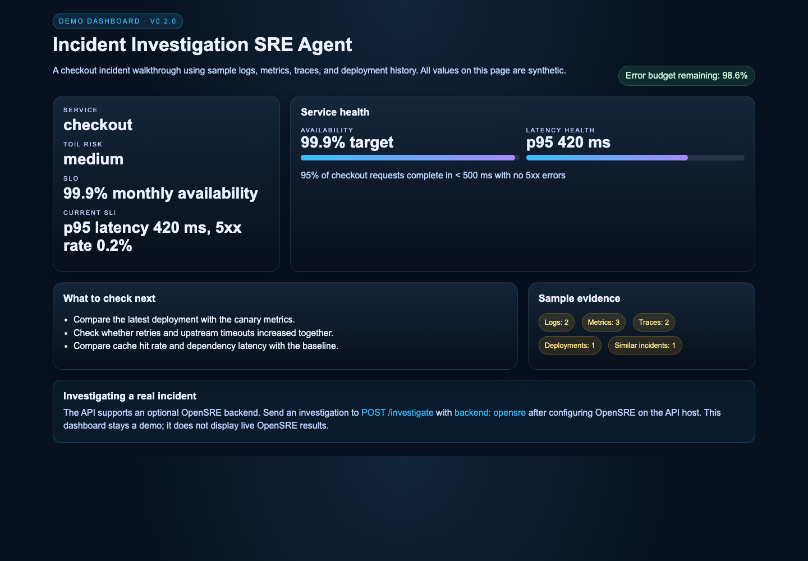

# Incident Investigation SRE Agent

Incident investigation API, sample dashboard and optional OpenSRE backend.
Current code version: **0.2.0** (unpublished).

[Setup and usage](incident-investigation-sre-agent/README.md) ·
[Changelog](incident-investigation-sre-agent/CHANGELOG.md) ·
[Functionality assessment](incident-investigation-sre-agent/docs/ASSESSMENT.md)

The demo uses synthetic evidence. The optional OpenSRE backend investigates
through tools configured in your own OpenSRE installation.

