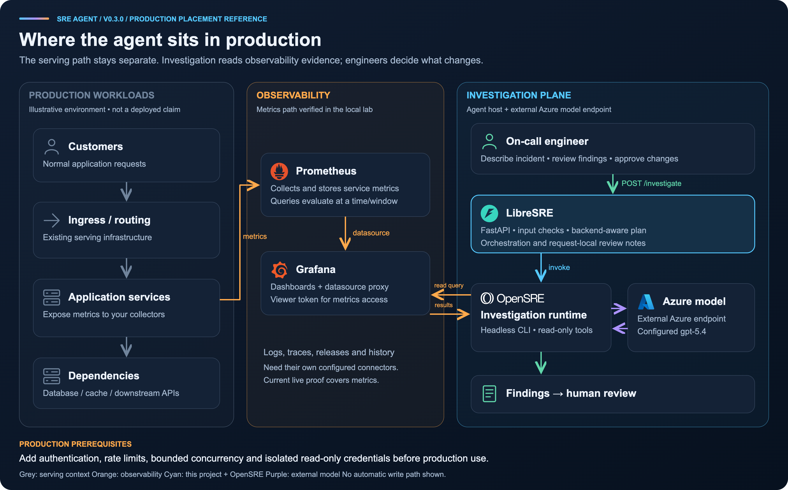
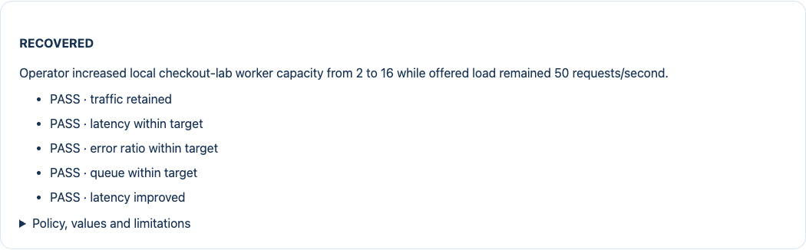
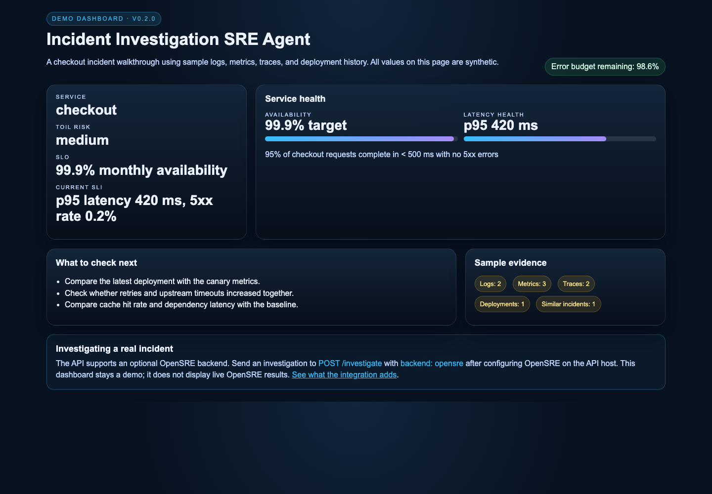
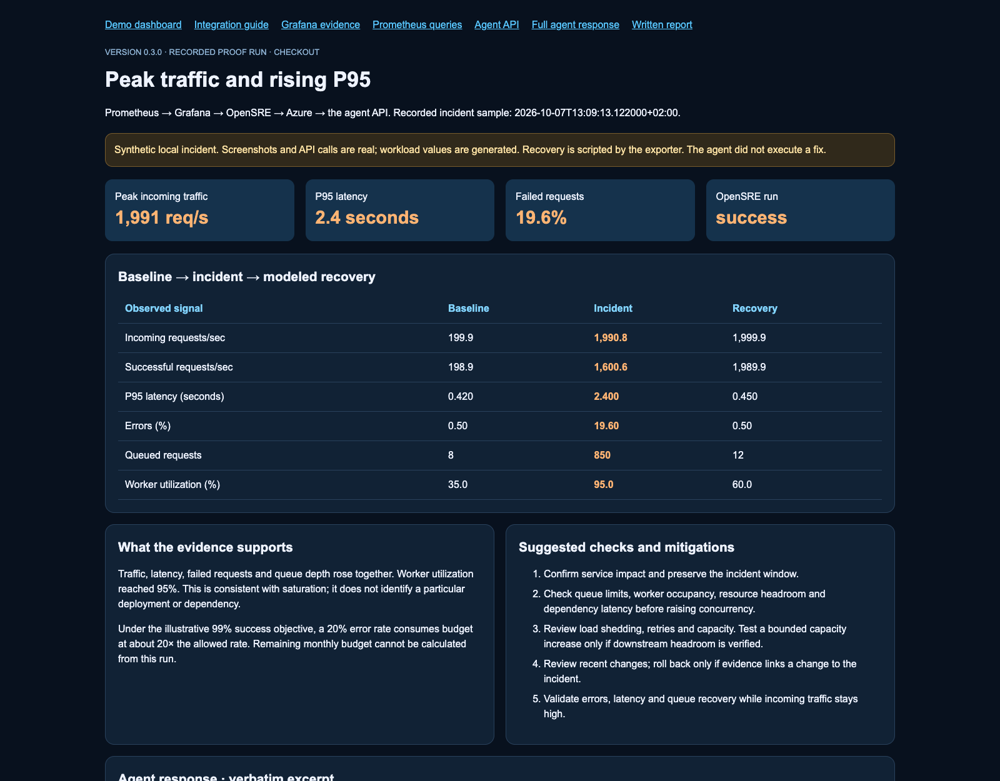
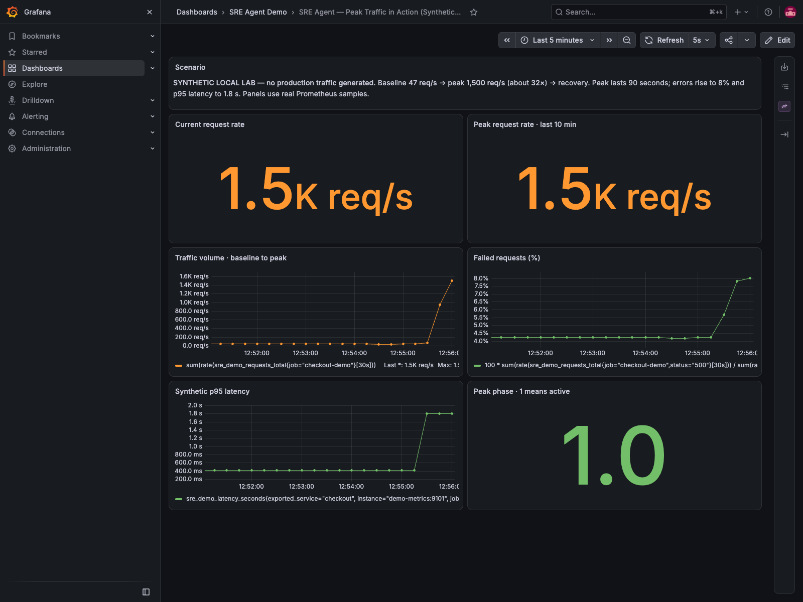

# LibreSRE

**Open investigation. Verified recovery.**

An incident investigation and recovery workspace that helps engineers connect service symptoms to
observability evidence. Describe the incident, choose an evidence backend, and
review the findings, uncertainties, and next debugging steps.

The project addresses a common on-call problem: traffic, latency, errors, and
saturation signals are easy to inspect separately but harder to interpret
together. It gives that investigation a consistent entry point and keeps the
engineer responsible for deciding what to change.

Previously named **Incident Investigation SRE Agent**. The repository URL, Python
package name and API paths stay compatible. Archived proof screenshots retain
the name shown when they were captured.

**Version 0.4.0 · Python 3.11+ · Local evaluation and documented demos**

[Overview](#overview) · [Screenshots](#screenshots) · [Deployment](#deployment) ·
[Important information](#important-information) · [Use cases and proof of work](#use-cases-and-proof-of-work) ·
[Documentation](docs/index.md)

## Overview

The agent has two investigation paths:

| Backend | Evidence | What you receive |
| --- | --- | --- |
| `demo` | Sample logs, metrics, traces, deployments, and incident history | Illustrative hypotheses, suggested checks, and an optional model summary |
| `opensre` | Observability tools configured in your local OpenSRE installation | A model-written investigation summary, questions, denied tools, and review notes |

The demo works without credentials. The OpenSRE path can query your configured
sources; the recorded local proof uses Grafana and Prometheus with Azure
`gpt-5.4` for reasoning. The API does not execute remediation.

### How the components fit together



This is a recommended production placement, not a claim of an existing production
deployment. The metrics connection was verified in the local lab. The agent stays
outside the customer request path and returns findings for engineer review.

[Investigation flow and architecture guide](docs/ARCHITECTURE.md) ·
[Editable diagram](docs/assets/architecture/production-placement.svg)

OpenSRE supplies the tool integrations and investigation runtime. This project
supplies the HTTP entry point, backend selection, investigation plan and notes,
example dashboards, and recorded cases. Read [why this integration was chosen](docs/OPENSRE_INTEGRATION.md).

### What is new in 0.4.0

- A persistent incident workspace: investigations survive application restarts.
- Saved PromQL queries, raw observations and timestamps alongside each incident.
- Recovery checks that require healthy metrics and comparable traffic.
- A real-request lab with an operator-controlled worker capacity intervention.
- Optional tenant keys, scoped records, allowed services and separate tool profiles.

Open [the workspace guide](docs/INCIDENT_WORKSPACE.md) for setup, endpoints and
operating limits. The default is a local workspace; optional tenant mode adds
application-level isolation, with operating limits documented in the guide. OpenSRE remains the live investigation runtime. The new persistence
and recovery evaluation belong to this project.

The [0.3.0 overload case](docs/case-studies/checkout-overload/README.md) remains
available as a synthetic workload demonstration. See the [changelog](CHANGELOG.md)
for version history. The code version has not been published as a package release.

## Screenshots

### Persistent workspace and recovery checks

Saved investigations now retain their reports and query evidence across restarts.
The recovery view compares observations against an explicit policy and traffic
floor, rather than relying on a model's assurance.



[Real-request case and agent findings](docs/case-studies/worker-capacity/README.md) ·
[Workspace screenshot](docs/case-studies/worker-capacity/screenshots/workspace-desktop.png) ·
[Setup and tenant isolation](docs/INCIDENT_WORKSPACE.md)

### Demo dashboard

A credential-free checkout walkthrough showing sample service health, error
budget, evidence coverage, and suggested checks. The displayed values are
synthetic; this page does not show live OpenSRE investigations.



[Mobile preview](docs/screenshots/dashboard-mobile.png) ·
[OpenSRE integration overview](docs/screenshots/opensre-integration.png)

### Recorded investigation dashboard

A separate view of the overload proof: baseline/incident/recovery measurements,
the agent's returned findings, and proposed engineering checks. This is an
archived run, not a live production console.



[Complete agent findings screenshot](docs/case-studies/checkout-overload/screenshots/agent-findings.png) ·
[Written incident report](docs/case-studies/checkout-overload/README.md)

## Deployment

### 1. Run the API locally

```bash
git clone https://github.com/sumitsharma01/Incident-Investigation-SRE-Agent.git
cd Incident-Investigation-SRE-Agent
python3 -m venv .venv
source .venv/bin/activate
pip install -e '.[test]'
uvicorn app.main:app --reload
```

Open http://127.0.0.1:8000/docs for the API documentation.
`GET /health` reports the service status and code version.

Try a demo investigation:

```bash
curl http://127.0.0.1:8000/investigate \
  -H 'Content-Type: application/json' \
  -d '{"service":"checkout","description":"P95 latency increased during peak traffic","backend":"demo"}'
```

### 2. Open the dashboards

In another terminal, from the repository root with the virtual environment active:

```bash
python examples/dashboard_app.py
```

| Page | Address | Purpose |
| --- | --- | --- |
| Demo | http://127.0.0.1:8001/ | Explore the sample checkout context |
| Integration guide | http://127.0.0.1:8001/integration | Understand the OpenSRE request flow and setup |
| Recorded case | http://127.0.0.1:8001/case-study | Review the committed overload run and agent findings |

### 3. Connect Grafana, Prometheus, and OpenSRE

Follow the [step-by-step integration guide](docs/GRAFANA_PROMETHEUS_QUICKSTART.md).
It covers the local Docker lab, an existing Grafana instance, a read-only service
account token, datasource verification, model configuration, and the first request.

OpenSRE must be installed and configured on the API host. Its headless CLI can
use your own model provider without an OpenSRE account. Save local credentials
in the ignored `.env`, then start the API with:

```bash
uvicorn app.main:app --env-file .env
```

Select the configured backend in your request:

```bash
curl http://127.0.0.1:8000/investigate \
  -H 'Content-Type: application/json' \
  -d '{"service":"checkout","description":"Use configured metrics to compare traffic, P95 latency and errors over the last 15 minutes. Report missing evidence and safe next checks.","backend":"opensre"}'
```

For optional model summaries on the demo backend, see
[model and provider configuration](docs/MODEL_CONFIGURATION.md). Those settings
are separate from OpenSRE's provider configuration.

### Docker alternative

The existing image runs the API with the demo backend:

```bash
docker compose -f docker/docker-compose.yml up --build
```

The image does not include OpenSRE or the dashboard application. Install and
configure OpenSRE in your runtime image if you want that backend in a container.
The separate observability lab and its startup steps are covered in the
[integration guide](docs/GRAFANA_PROMETHEUS_QUICKSTART.md).

## Important information

### Reading the result

OpenSRE findings appear in `summary`, with `investigation_plan` and
`investigation_notes` alongside them. Its `hypotheses` array stays empty because
the upstream CLI does not guarantee this project's structured hypothesis format.

| Status | What to do |
| --- | --- |
| `success` | Review the findings, source evidence, and uncertainties |
| `needs_input` | Read `questions` and provide the missing context |
| `approval_required` | Review `denied_tools`; the adapter grants no additional tools |
| `error` | Check installation, configuration, or the runtime failure |

Incomplete runs set `safe_to_continue=false`. OpenSRE failures never substitute
sample evidence. Calls are ephemeral; use OpenSRE directly when you need session
resumption or tool approvals.

### Scope and limits

- The demo collectors and hypotheses are fixed examples. Their confidence scores are not calibrated probabilities.
- The live proof verifies the local metrics path. Logs, traces, deployment history, and previous incidents remain demo sources in this project.
- Suggested fixes require human review. Recovery in the recorded cases was scripted by the exporter.
- The API has no authentication, rate limiting, or job queue. Use it on a trusted local network while evaluating it; the Docker Compose API port is published on the host.
- Each OpenSRE request occupies a worker while its process runs. Production deployment needs access controls, concurrency limits, isolated credentials, and incident-level evaluation.

The [functionality assessment](docs/ASSESSMENT.md) and
[live verification history](docs/LIVE_VERIFICATION.md) explain these limits and
what has actually been checked. Keys and tokens belong in ignored local files
or a secret manager.

## Use cases and proof of work

The cases below are separate exercises. They use different generated workloads;
their screenshots should be read with the corresponding report and timestamps.

### Case 1: investigate peak traffic and rising P95

This is the main end-to-end proof. A real HTTP request passed through the agent,
OpenSRE, Grafana, Prometheus, and the configured Azure model. The model
independently queried traffic, P95, and queue depth, then returned its findings.

| Signal | Baseline | Incident | Modeled recovery |
| --- | ---: | ---: | ---: |
| Incoming requests/sec | 200 | 1,991 | 2,000 |
| P95 latency | 420 ms | 2.4 s | 450 ms |
| Failed requests | 0.5% | 19.6% | 0.5% |
| Queue depth | 8 | 850 | 12 |


The agent identified a saturation/backlog pattern and left the exact bottleneck
unproven. The report includes its verbatim response, direct metric snapshots,
failed and successful attempts, prioritized checks, rollback criteria, and replay
steps. Workload values were synthetic; queries and model calls were real.

[Read the complete case](docs/case-studies/checkout-overload/README.md) ·
[Prometheus evidence](docs/case-studies/checkout-overload/screenshots/prometheus-incident.png) ·
[Recovery screenshot](docs/case-studies/checkout-overload/screenshots/grafana-recovery.png) ·
[Raw agent response](docs/case-studies/checkout-overload/agent-response.json)

### Case 2: visualize a controlled traffic peak

A smaller tutorial raises generated traffic from 47 to roughly 1,500 requests/sec,
with 8% errors and 1.8-second P95 latency. It demonstrates the metric queries,
peak-volume panels, and screenshot capture without a full incident investigation.

<details>
<summary>Show the Grafana peak-traffic screenshot</summary>



</details>

[Replay the peak demo](docs/PEAK_TRAFFIC_DEMO.md) ·
[Prometheus peak values](docs/screenshots/prometheus-peak-traffic.png)

### Case 3: verify the observability connection

Start with this tutorial when bringing up the lab or connecting your Grafana
instance. It checks datasource access and a Prometheus `up` query before involving
a model. The steady demo shows roughly 47 requests/sec and 420 ms latency.

[Setup and verification tutorial](docs/GRAFANA_PROMETHEUS_QUICKSTART.md) ·
[Grafana steady-state screenshot](docs/screenshots/grafana-prometheus-demo.png) ·
[Prometheus query screenshot](docs/screenshots/prometheus-demo-query.png)

## Development and references

Run `pytest -q` from the repository root. Version 0.3.0 has **28 passing tests**.
The automated suite uses mocked provider calls; live validation is documented
separately in the recorded cases. Screenshot capture and replay commands live
with each tutorial.

| Directory | Contents |
| --- | --- |
| `app/` | API, orchestration, provider adapter, sample collectors, and reasoning |
| `examples/` | Dashboards, connection checks, proof recorder, and capture scripts |
| `docker/` | API image and local observability lab |
| `docs/` | Setup guides, assessment, case reports, raw evidence, and screenshots |
| `tests/` | API, adapter, scenario, dashboard, and output-safety checks |

[Documentation index](docs/index.md) · [Changelog](CHANGELOG.md) ·
[OpenSRE integration decision](docs/OPENSRE_INTEGRATION.md)

Primary references: [OpenSRE](https://github.com/Tracer-Cloud/opensre),
[OpenSRE headless CLI contract](https://github.com/Tracer-Cloud/opensre/blob/288a82456af27ce75487527b2b21c7ab1cbf5d6b/docs/guides/headless-cli.mdx),
[Prometheus HTTP API](https://prometheus.io/docs/prometheus/latest/querying/api/),
and [Grafana service accounts](https://grafana.com/docs/grafana/latest/administration/service-accounts/).
The case report records tested component versions and distinguishes the reviewed
OpenSRE source reference from the installed binary.
