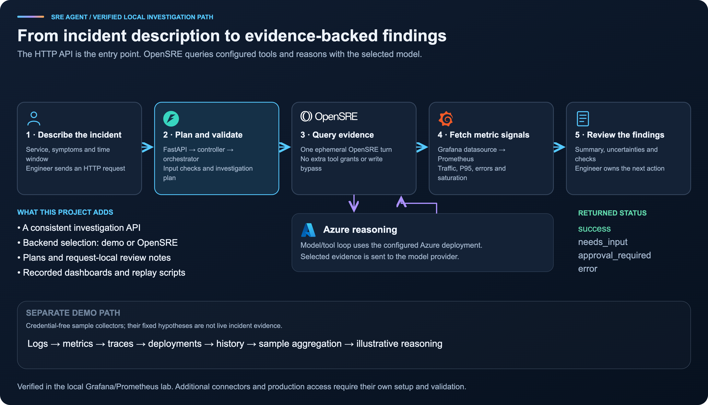
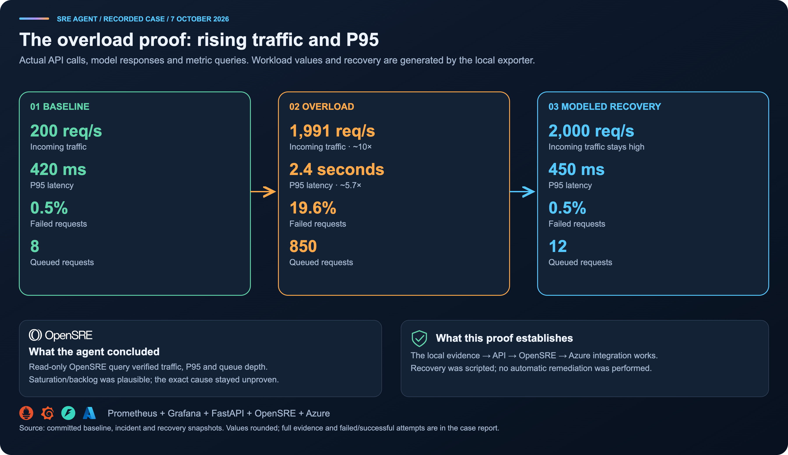

# Architecture and production placement

[Project home](../README.md) · [Integration guide](OPENSRE_INTEGRATION.md) ·
[Recorded overload case](case-studies/checkout-overload/README.md)

## Where this project sits

The agent is an investigation service beside your observability stack. Customer
requests continue through the existing application path. An engineer submits an
incident to the API; OpenSRE queries configured sources, reasons with the selected
model, and returns findings for review.

The production workload boxes describe a reference environment, not infrastructure
that this repository deploys. The colored metrics path was verified against the
local Grafana/Prometheus lab. Logs, traces, deployment events, and incident history
need separate live connectors; the corresponding project collectors remain demos.

The current API needs authentication, rate limits, bounded process concurrency,
and isolated read-only credentials before a production rollout. Selected evidence
is sent to the configured model provider. No automatic remediation path is shown
because the adapter does not grant write tools or execute the suggested fixes.

[Editable SVG](assets/architecture/production-placement.svg)

## How an investigation runs

1. An engineer supplies a service, symptoms, and a time window.
2. FastAPI routes the request through the controller and orchestrator, which validate inputs and attach a backend-aware plan.
3. OpenSRE runs one ephemeral headless turn using configured tools and model credentials.
4. Grafana's datasource proxy provides Prometheus observations; model/tool calls can repeat as needed.
5. The API returns a summary, uncertainties, questions or denied tools, and request-local review notes.

The graphic is a logical flow, not a promise of exactly one tool call or five
sequential model steps. OpenSRE owns the reasoning/tool loop. The separate demo
backend uses sample collectors and fixed illustrative hypotheses; its evidence
must not be mixed into a live incident.

[Editable SVG](assets/architecture/investigation-flow.svg) ·
[Provider configuration](MODEL_CONFIGURATION.md)

## What the recorded proof shows

The diagram summarizes the committed snapshots, rounded for readability. The
agent independently queried incident traffic, P95 and queue depth. Other signals
and recovery comparisons came from direct Prometheus queries. The exact cause
was not established. Recovery was generated by the exporter, not executed by
the agent or measured from a real capacity change.

[Complete case report and raw evidence](case-studies/checkout-overload/README.md) ·
[Editable SVG](assets/architecture/overload-proof.svg)

## Visual references and asset sources

The review of OpenSRE's visual assets found three useful conventions: environment
boundaries in its architecture drawing, distinct color fields in its banners,
and recognizable product marks in the integrations list. These diagrams use
those conventions with original layouts tailored to this project's actual scope.
They do not copy Tracer's deployment architecture, eBPF collection path, hosted
product features or remediation behavior.

Reviewed source: [OpenSRE at commit 288a824](https://github.com/Tracer-Cloud/opensre/tree/288a82456af27ce75487527b2b21c7ab1cbf5d6b),
including `docs/images/Tracer-Functioning-Light.png`,
`docs/assets/icons/BannerGithub.png`, and `docs/images/hero-dark.png`.

See [graphics sources and attribution](assets/architecture/README.md) for brand
asset origins, retained licenses and regeneration instructions. Brand marks
identify the components; they do not imply endorsement or affiliation.
