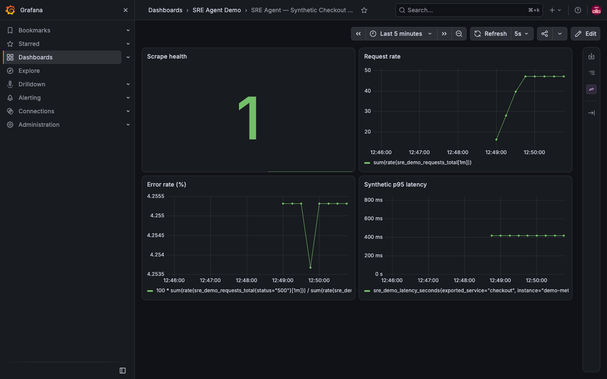
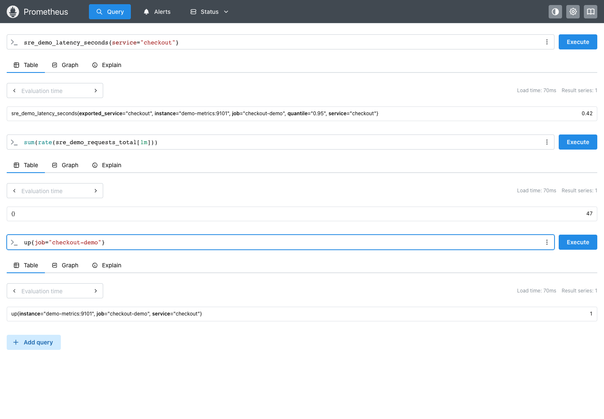

# Connect Grafana and Prometheus to the SRE agent

This walkthrough starts with the included local lab. Grafana and Prometheus
are real services; the checkout exporter produces synthetic metrics. For an
existing instance, use the final section instead.

## Captured demo results

These screenshots were captured from the local lab on 7 October 2026. Grafana
13.2.3 displays live queries; Prometheus 3.15.0 returns the generator's samples.
The observed values are approximately 47 requests/second, 4.26% failures,
420 ms p95 latency and scrape health 1. These are synthetic demo measurements.





The scoped OpenSRE API investigation also completed successfully with no
denied tools and reported a failed-request rate of 4.2553%. See the
[live verification report](LIVE_VERIFICATION.md) for the scope and limitations.

## 1. Install the prerequisites

Use Python 3.11 or later and a running Docker Desktop/Engine. Install OpenSRE
from its official repository. From this repository's root:

```bash
python3 -m venv .venv
source .venv/bin/activate
pip install -e '.[test,screenshots]'
playwright install chromium
```

## 2. Create local configuration

Copy `.env.example` to `.env` if you do not already have one. Keep existing
model credentials. Generate a separate local Grafana admin password:

```bash
python -c 'from pathlib import Path; import secrets; p=Path(".env.observability"); p.exists() or p.write_text("SRE_DEMO_GRAFANA_ADMIN_PASSWORD="+secrets.token_urlsafe(24)+"\n"); p.chmod(0o600)'
```

Both files are ignored by Git. Never commit keys or Grafana tokens.

## 3. Start the observability lab

```bash
docker compose --env-file .env.observability -f docker/observability/compose.yml up -d
```

The stack provisions Prometheus datasource `sre-demo-prometheus`, a checkout
metrics dashboard and a metrics exporter. Ports bind to localhost.

Open Grafana at http://127.0.0.1:3000/d/sre-checkout-demo and Prometheus at
http://127.0.0.1:9090. Grafana login is `admin`, with the password in your local
`.env.observability` file. Wait at least one minute for rate metrics.

## 4. Create the read-only token

```bash
python examples/setup_local_grafana.py
```

This creates a Viewer service account and a seven-day token. It saves these
settings in `.env` without printing the token:

```dotenv
GRAFANA_INSTANCE_URL=http://127.0.0.1:3000
GRAFANA_READ_TOKEN=
GRAFANA_VERIFY_SSL=true
GRAFANA_MIMIR_DATASOURCE_UID=sre-demo-prometheus
```

The actual token is filled locally by the script. Prometheus is queried through
Grafana's proxy, so the agent does not need a separate Prometheus credential.

## 5. Verify access before using the model

```bash
python examples/verify_grafana.py
```

Expect `status=success`, datasource UID `sre-demo-prometheus`, and two `up`
series. This verifies access; inspect scrape health separately to confirm the
individual targets are up. An empty vector means no matching samples, not zero
errors or a healthy service.

In Prometheus, execute each query below:

| Signal | PromQL | Expected sample value |
| --- | --- | --- |
| Exporter scrape health | `up{job="checkout-demo"}` | `1` |
| Requests per second | `sum(rate(sre_demo_requests_total[1m]))` | About `47` |
| Failed requests (%) | `100 * sum(rate(sre_demo_requests_total{status="500"}[1m])) / sum(rate(sre_demo_requests_total[1m]))` | About `4.26` |
| Synthetic p95 latency | `sre_demo_latency_seconds{quantile="0.95"}` | `0.42` seconds |

Rates can vary slightly because the exporter rounds counters. These figures
describe the generator; they are not production measurements.

## 6. Configure the local OpenSRE model

OpenSRE headless mode can use your own Azure provider without an OpenSRE account.
For this project's Azure example, configure the following in `.env`, alongside
your locally saved `AZURE_OPENAI_API_KEY`:

```dotenv
LLM_PROVIDER=azure
LLM_MODEL=gpt-5.4
OPENSRE_LLM_PROVIDER=azure-openai
OPENSRE_LLM_TRANSPORT=litellm
AZURE_OPENAI_BASE_URL=https://soloai-v0-resource.cognitiveservices.azure.com
AZURE_OPENAI_API_VERSION=2025-04-01-preview
AZURE_OPENAI_REASONING_MODEL=gpt-5.4
AZURE_OPENAI_TOOLCALL_MODEL=gpt-5.4
AZURE_OPENAI_CLASSIFICATION_MODEL=gpt-5.4
```

For a different resource, replace the URL and deployment names. Set
`OPENSRE_BINARY` to the installed executable if it is not on your PATH.

## 7. Run the agent and request metrics

```bash
uvicorn app.main:app --env-file .env
```

In another terminal:

```bash
curl http://127.0.0.1:8000/investigate \
  -H 'Content-Type: application/json' \
  -d '{"service":"checkout","backend":"opensre","description":"This is a synthetic local lab. Use only query_grafana_metrics with datasource sre-demo-prometheus. Query up{job=\"checkout-demo\"}, sum(rate(sre_demo_requests_total[1m])) and sre_demo_latency_seconds{quantile=\"0.95\"}. Report queries, observations and missing evidence. Do not call alert, shell or write tools."}'
```

Review `status`, `summary`, `denied_tools` and `questions`. A denied tool stays
denied; do not bypass approvals to make a screenshot or demo look successful.
Grafana query success alone does not establish that OpenSRE selected the right
tools or completed an investigation.

## 8. Capture the live demo pages

```bash
python examples/capture_observability.py
```

The script first verifies that latency and request-rate samples exist, then
captures the actual Grafana dashboard and Prometheus query page. Inspect the
images in `docs/screenshots/` before committing. You can supply an installed
Chrome executable with `--executable-path`.

## 9. Stop the lab

```bash
docker compose --env-file .env.observability -f docker/observability/compose.yml down
```

This keeps the data volumes. No production services are connected by this guide.

## Use an existing Grafana instance

Skip local Docker/token provisioning. Create a Grafana Viewer service account
with access to your Prometheus datasource, save its token in `.env`, and set
`GRAFANA_INSTANCE_URL` to your HTTPS base URL. Use your datasource UID in
`GRAFANA_MIMIR_DATASOURCE_UID`; set `GRAFANA_CA_BUNDLE` for a private CA. Run
`verify_grafana.py` and use actual service labels and metric names in requests.

## Troubleshooting

- HTTP 401: check token expiration and the Grafana instance it belongs to.
- HTTP 403: check service-account role and datasource permissions.
- Empty query: check the exporter target and allow a minute for rate samples.
- Browser login error or blank page: inspect Grafana's logs; do not publish a blank screenshot.
- Docker `input/output error`: restore Docker storage health before rerunning. Do not prune or reset existing Docker data without reviewing what would be lost.

See [runtime findings and references](GRAFANA_PROMETHEUS.md) and the
[live verification report](LIVE_VERIFICATION.md) for the current verification status.
