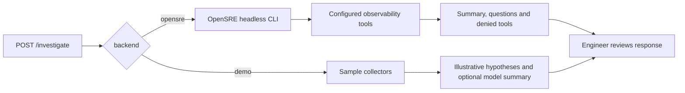

# OpenSRE integration in version 0.2.0

## Why add it?

The original agent is a local walkthrough: its collectors return sample data,
and its two hypotheses describe a checkout incident. That makes it useful for
learning the API, but it cannot tell you what happened in your own service.

OpenSRE supplies a separate investigation runtime with observability and
infrastructure integrations. Rather than copy those tools into this project,
the agent calls OpenSRE through its documented headless CLI. The API remains
small, and the demo still runs without credentials.

## What is new?

| Before | Version 0.2.0 |
| --- | --- |
| Every request used sample evidence | Requests can select the demo or OpenSRE backend |
| Two fixed checkout hypotheses | OpenSRE returns its investigation narrative in `summary` |
| Model output was discarded | Optional Azure/OpenAI summaries appear in API responses |
| Demo limitations were easy to miss | Responses and dashboard explicitly identify sample evidence |
| No external runtime status | Responses report errors, questions and denied tools |
| Application inside a second project folder | Application, examples, tests and docs live at the repository root |

The dashboard at `/integration` explains this flow. The dashboard at `/` still
shows the sample checkout data. Neither page is a live incident console.

## Request flow



The adapter runs this command, sending the incident as JSON within its stdin prompt:

```bash
opensre --json ask --ephemeral -
```

There is no shell command interpolation, `--allowed-tool` grant or approval
bypass. OpenSRE controls tool approvals, and its configured credentials control
resource access. Use read-only credentials and an isolated service account.

## Setup and first request

1. Install OpenSRE using the upstream instructions.
2. Authenticate its model provider. This is separate from the Azure summary settings in this agent.
3. Configure the observability tools needed for your service.
4. Verify a headless CLI request on the API host before calling this API.
5. Start this project with `uvicorn app.main:app` from the repository root.

```bash
curl http://127.0.0.1:8000/investigate \
  -H 'Content-Type: application/json' \
  -d '{"service":"checkout","description":"P95 latency increased after the latest release. Check the last hour.","backend":"opensre"}'
```

Read `summary` for findings. Read `questions` when `status=needs_input` and
`denied_tools` when `status=approval_required`. An incomplete run sets
`safe_to_continue=false`. An error never substitutes synthetic observations.

OpenSRE results leave `hypotheses=[]`: the CLI does not guarantee this agent's
structured hypothesis format. A successful turn means execution completed;
it does not establish that the findings are correct or sufficient.

Calls are ephemeral. Send missing context in a new request, or use OpenSRE
directly when you need a resumable session or operator tool approval.

## Versions and references

- **This agent:** code version 0.2.0, unpublished. See [CHANGELOG.md](../CHANGELOG.md).
- **OpenSRE reference:** source commit `288a82456af27ce75487527b2b21c7ab1cbf5d6b`, whose README identifies the project as v0.1/public alpha. The adapter does not bundle or pin an installed OpenSRE binary.
- **Azure example:** deployment name `gpt-5.4`, supplied Responses target API version `2025-04-01-preview`. Both passed a live authenticated connectivity check; see [live verification](LIVE_VERIFICATION.md).

Primary OpenSRE references, pinned to the reviewed source:

- [README and supported integrations](https://github.com/Tracer-Cloud/opensre/blob/288a82456af27ce75487527b2b21c7ab1cbf5d6b/README.md)
- [Headless CLI: JSON output, exit codes and tool approvals](https://github.com/Tracer-Cloud/opensre/blob/288a82456af27ce75487527b2b21c7ab1cbf5d6b/docs/guides/headless-cli.mdx)
- [HTTP API: alert intake rather than a synchronous investigation endpoint](https://github.com/Tracer-Cloud/opensre/blob/288a82456af27ce75487527b2b21c7ab1cbf5d6b/docs/guides/api.mdx)
- [Embedded Python API: alternative requiring a source checkout](https://github.com/Tracer-Cloud/opensre/blob/288a82456af27ce75487527b2b21c7ab1cbf5d6b/docs/guides/python-api.mdx)

The CLI was chosen over `/alerts` because the HTTP endpoint queues alerts and
does not return a synchronous investigation. The embedded Python runtime
would require a larger source dependency and tighter coupling to upstream.

## Verification and remaining work

Tests cover the subprocess contract and failure paths with mocks. Screenshots
show the rendered demo and integration guide. Azure and OpenSRE model connectivity subsequently passed live checks; see
[live verification](LIVE_VERIFICATION.md). Production tool access remains unverified.

For a production service, add authentication, rate limits, bounded process
concurrency, audited credentials and real-incident evaluation. The current
API is intended for trusted local use. See the [assessment](ASSESSMENT.md)
for the complete list of gaps.
