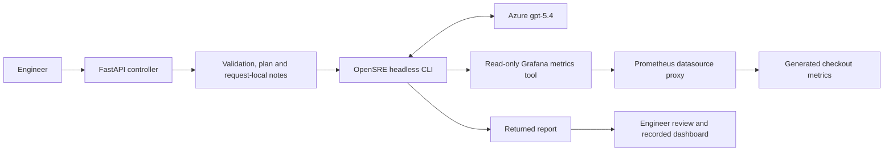
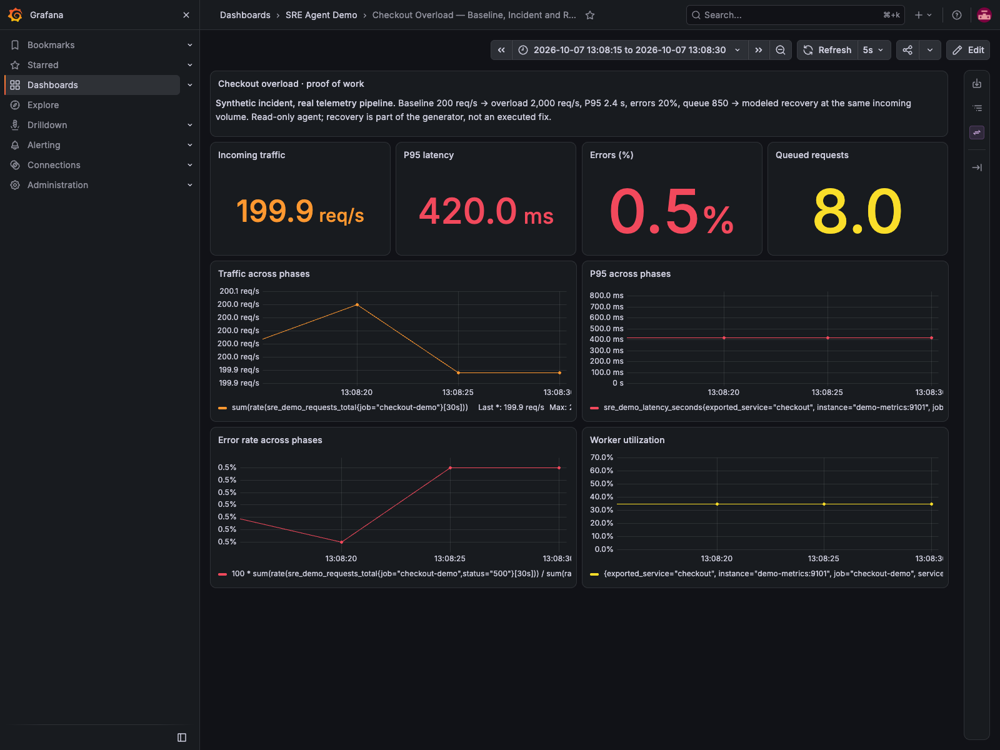
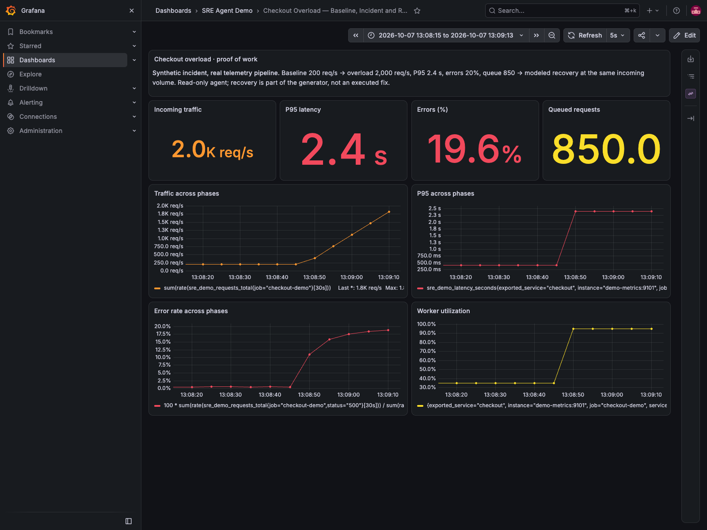
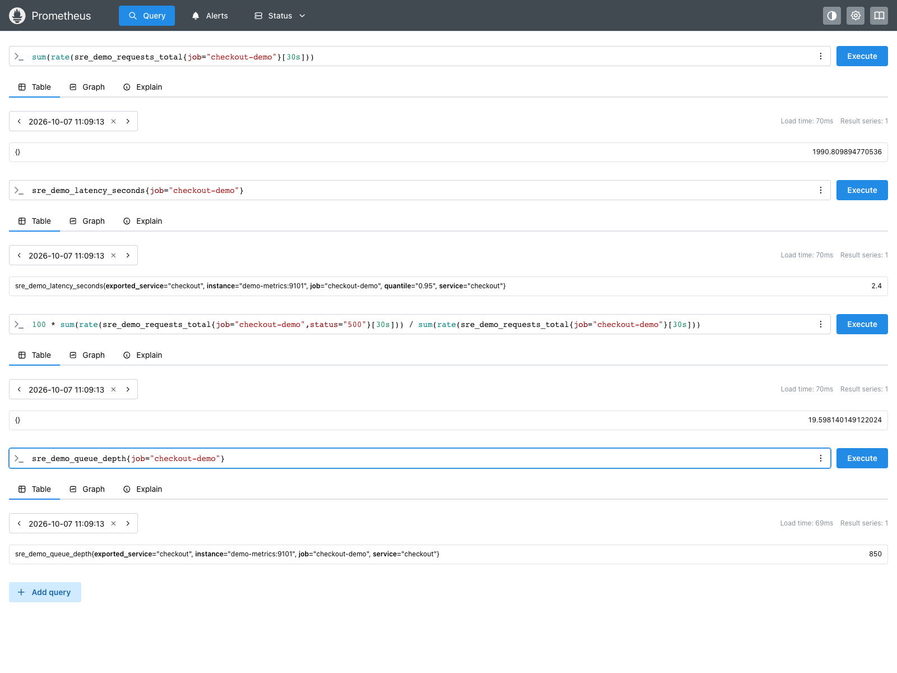
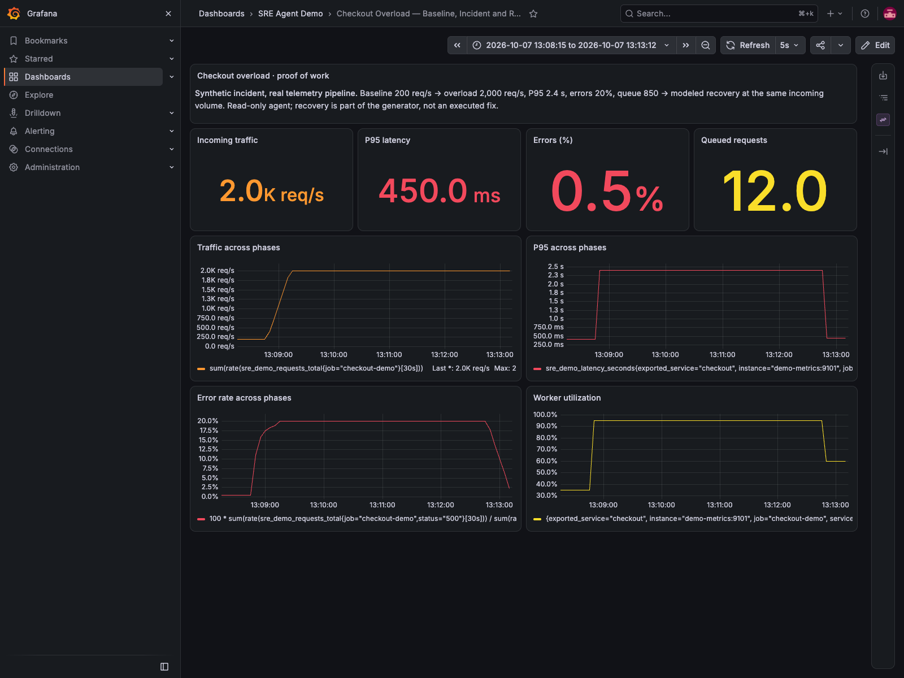
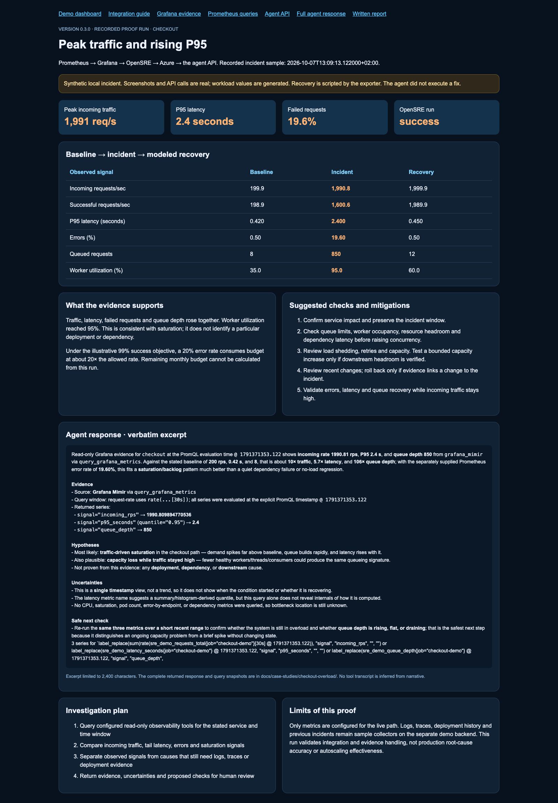

# Checkout overload: peak traffic and rising P95

[Project home](../../../README.md) · [Documentation index](../../index.md) ·
[Grafana/Prometheus setup](../../GRAFANA_PROMETHEUS_QUICKSTART.md) ·
[Raw agent response](agent-response.json) · [All recorded evidence](run.json)

This case follows a checkout incident through the project: the sample exporter,
Prometheus, Grafana, the HTTP API, its planner and request-local notes, OpenSRE,
and the configured Azure model. It includes baseline, overload and recovery
measurements, the actual agent response, and steps an engineer could take next.

**Scope:** a synthetic local incident with real queries and model calls. No
production traffic was generated. The recovery was scheduled by the exporter;
the agent did not change infrastructure or prove that a real mitigation works.

## Request and evidence path



## What happened

The generator increased incoming checkout traffic from roughly 200 to 2,000
requests/sec. During the incident, P95 latency rose from 420 ms to 2.4 seconds,
failed requests approached 20%, and the queue reached 850 requests. The modeled
worker utilization signal increased from 35% to 95%.

After the scripted recovery transition, incoming traffic stayed near 2,000
requests/sec. P95 fell to 450 ms, errors to 0.5%, and queue depth to 12. This
makes the recovery comparison useful: improved metrics were not explained by
a drop in incoming traffic. It remains a programmed result, not a load-test
measurement of a real checkout application.

| Signal | Baseline | Overload | Modeled recovery |
| --- | ---: | ---: | ---: |
| Incoming requests/sec | 199.94 | 1,990.81 | 1,999.92 |
| Successful requests/sec | 198.94 | 1,600.65 | 1,989.92 |
| P95 latency | 420 ms | 2,400 ms | 450 ms |
| Failed requests | 0.50% | 19.60% | 0.50% |
| Queue depth | 8 | 850 | 12 |
| Worker utilization, generated gauge | 35% | 95% | 60% |
| Capacity rejections/sec | 0 | 388.16 | 0 |

The incident snapshot was taken during the edge of the 30-second rate window,
so measured traffic/errors are slightly below the generator's steady incident
targets of 2,000 requests/sec and 20%. Gauges change immediately; rates smooth
phase changes. P95 values are generated gauges, not quantiles calculated from
request histograms.

Exact timestamps, PromQL and values are recorded in [baseline.json](baseline.json),
[incident.json](incident.json) and [recovery.json](recovery.json). Timestamps in
those files use Europe/Berlin; the Prometheus UI's displayed evaluation time is UTC.

## Evidence screenshots

These are browser captures of the running services, evaluated at the recorded
phase timestamps. They are not mockups. Grafana uses a fixed time range so the
incident window remains visible after the exporter moves into recovery.

### Baseline

The baseline plot starts after startup/counter-reset artifacts have settled.



### Overload





### Modeled recovery



## What the agent found

The final request went through **POST /investigate**, with `backend=opensre`.
OpenSRE used `query_grafana_metrics` to retrieve three incident series through
Grafana's Prometheus datasource proxy: traffic, P95 and queue depth. The PromQL
used the recorded incident timestamp, making the comparison reproducible while
those samples remain in Prometheus's retention window.

The agent reported **1,990.81 requests/sec**, **2.4-second P95**, and **queue depth
850**. It compared these with the supplied baseline and described a saturation/
backlog pattern. Its alternatives included traffic-driven saturation and a loss
of effective capacity. It explicitly did **not** establish a deployment,
dependency or downstream root cause.

The error percentage was supplied from a separate direct Prometheus snapshot;
the final agent query did not independently retrieve it. Worker utilization,
rejections and recovery values in this report also come from the direct
snapshots. The returned source label is `grafana_mimir`, an OpenSRE adapter
label; the actual datasource in this lab is OSS Prometheus, not a Mimir cluster.

Its next check was to query the same signals over a short range and determine
whether the queue was growing, flat or draining. That is a useful first step:
it asks for trend evidence without changing state.



Read the [complete verbatim response](agent-response.json). The dashboard shows
an excerpt and a separate operator assessment; the operator text is not passed
off as something the model said. The response also identifies missing evidence,
including CPU, pod count, endpoint breakdown and dependency metrics. The latency
metric's generated gauge implementation is known from this repository, although
the model could not infer that implementation from the query alone.

### Attempts and limits

The first broad API investigation returned `status=error` after about 108 seconds.
Its request, response, health and timing are retained in [attempts/01](attempts/01).
The adapter withheld the raw provider error, so the exact cause of that failure
is not established.

A direct OpenSRE retry queried all eight supplied expressions, but its CLI
response mainly acknowledged plan completion. That output is retained in
[opensre-query-response.json](opensre-query-response.json); it is not treated as
a complete incident report.

The final API request narrowed the task to one grouped query and requested a
standalone report. It completed successfully in 19.81 seconds with no denied tools. See
[request.json](request.json), [execution.json](execution.json) and
[health.json](health.json). This is a successful recorded run, not a reliability
benchmark or a guarantee that every model invocation will succeed.

## Suggested fixes and verification

These are proposed engineering actions. None was executed by the agent.

| Priority | Action | Evidence to collect first | Success and rollback criteria |
| --- | --- | --- | --- |
| 1 | Confirm customer impact; protect the incident window | Errors by endpoint/status, customer journeys, queue trend | Keep evidence intact and identify affected requests |
| 2 | Bound retry amplification and queued work | Retry counts, queue age, rejection policy, timeout settings | Queue drains and errors fall without transferring failures downstream; revert if healthy traffic is rejected |
| 3 | Consider a small, reviewed capacity increase | Healthy worker count, CPU/memory, connection pools and downstream headroom | P95 and errors improve at sustained input; revert if downstream saturation or resource exhaustion grows |
| 4 | Review recent releases and configuration | Deployment timeline and before/after telemetry | Roll back only when a change is linked to degradation; compare equal traffic windows |
| 5 | Verify sustained recovery | Traffic, successful throughput, errors, P95, queue and worker signals together | P95 below 500 ms, errors below 1%, queue draining/stable at the same incoming load |

The 500 ms P95 and 99% success targets above are **illustrative case-study
thresholds**, not a configured production SLO. The observed incident error rate
would correspond to about 19.6× the allowed error rate under that illustrative
objective. A remaining monthly error budget cannot be calculated without the
actual objective, window and historical request/error counts.

A higher successful throughput alone does not mean customers are unaffected:
the incident still failed nearly one request in five. Likewise, increasing
concurrency blindly can make an overloaded dependency worse. Establish the
bottleneck and headroom before selecting a capacity or configuration change.

## Which components were exercised?

| Component | How it was used | Limit |
| --- | --- | --- |
| Exporter | Generated baseline, overload and recovery counters/gauges | Synthetic values; no real load generator |
| Prometheus | Scraped and stored metrics; ran timestamped queries | Local two-day retention; no production datasource |
| Grafana | Provisioned dashboards and read-only datasource proxy | Local Viewer token; screenshots captured with local admin browser access |
| FastAPI routes/controller | Received a real HTTP investigation request | Local unauthenticated service, unsuitable for public exposure |
| Planner | Returned a backend-aware investigation plan in the API result | Outline, not an autonomous task executor |
| Orchestrator and safety checks | Selected the backend, validated inputs and retained human review notes | Input validation is not an infrastructure permission boundary |
| Request-local memory | Recorded status and review notes | Not durable incident storage |
| OpenSRE | Queried read-only Grafana metrics and returned the final narrative | Root-cause certainty depends on available tools and evidence |
| Azure deployment | Powered OpenSRE's reasoning; deployment `gpt-5.4` | Paid model requests; results can vary |
| Demo collectors/aggregator/fixed reasoner | Exercised separately through the demo API path | Mock logs/traces/deployments/history were not mixed into this incident |
| Optional project LLM wrapper | Returned an Azure summary for the separate demo check | That summary was about demo evidence, not this incident |
| Dashboard | Displayed recorded evidence, the agent excerpt and navigation | Archived case view, not live connector health |

The separate demo response is in [demo-path-response.json](demo-path-response.json).
Its fixed hypotheses and confidence scores are illustrative; they do not support
this incident's conclusions. The earlier demo dataset and live incident generator
also use different sample values by design.

## Replay the proof

1. Follow the [Grafana/Prometheus quickstart](../../GRAFANA_PROMETHEUS_QUICKSTART.md), including the Viewer token and OpenSRE model configuration.
2. Start the agent: `OPENSRE_TIMEOUT_SECONDS=240 uvicorn app.main:app --env-file .env`.
3. Start the dashboard in another terminal: `uvicorn examples.dashboard_app:app --port 8001`.
4. Start the overload exporter, then immediately start the recorder:

```bash
SRE_DEMO_TRAFFIC_SCENARIO=overload docker compose --env-file .env.observability \
  -f docker/observability/compose.yml up -d --force-recreate demo-metrics
python examples/run_overload_proof.py
```

5. Allow roughly six minutes for baseline, incident, model calls and recovery. Check the response `status`; a script finishing does not guarantee an agent success.
6. Open http://127.0.0.1:8001/case-study. Its navigation links to Grafana, Prometheus, API docs, the complete response and this report.
7. Capture the recorded windows:

```bash
python examples/capture_overload_proof.py
```

The capture scripts accept `--executable-path` for an installed Chrome/Chromium
binary. Replaying writes new evidence files; keep a copy if you want to preserve
an earlier run. Grafana history depends on Prometheus retention, while committed
JSON and screenshots preserve this run.

## Versions and references

This case is documented with agent code **0.3.0**, OpenSRE **v2026.10.6**, Grafana
**13.2.3**, Prometheus **3.15.0**, and the configured Azure `gpt-5.4` deployment.
The initial API attempt reported 0.2.0; the final API attempt reported 0.3.0.
No package release or Git release tag is implied by the code version.

- [OpenSRE headless CLI, approvals and JSON output](https://github.com/Tracer-Cloud/opensre/blob/288a82456af27ce75487527b2b21c7ab1cbf5d6b/docs/guides/headless-cli.mdx)
- [OpenSRE Grafana integration](https://github.com/Tracer-Cloud/opensre/blob/288a82456af27ce75487527b2b21c7ab1cbf5d6b/docs/integrations/monitoring/grafana.mdx)
- [Prometheus query basics and timestamp modifiers](https://prometheus.io/docs/prometheus/latest/querying/basics/)
- [Prometheus HTTP API](https://prometheus.io/docs/prometheus/latest/querying/api/)
- [Grafana service accounts](https://grafana.com/docs/grafana/latest/administration/service-accounts/)

The OpenSRE links are pinned to the source reviewed during integration. The
installed binary's version is recorded separately; source-reference inspection
is not an assertion that those commits are the exact installed build.
