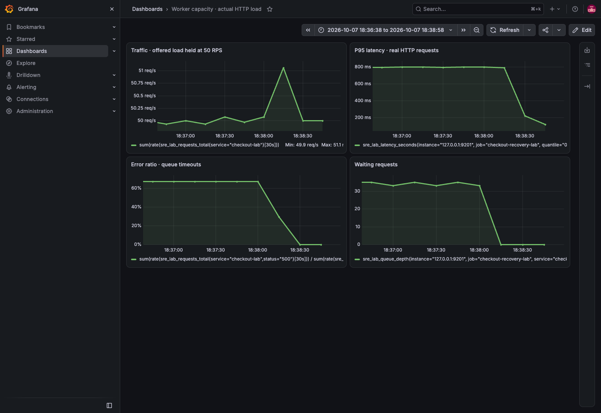
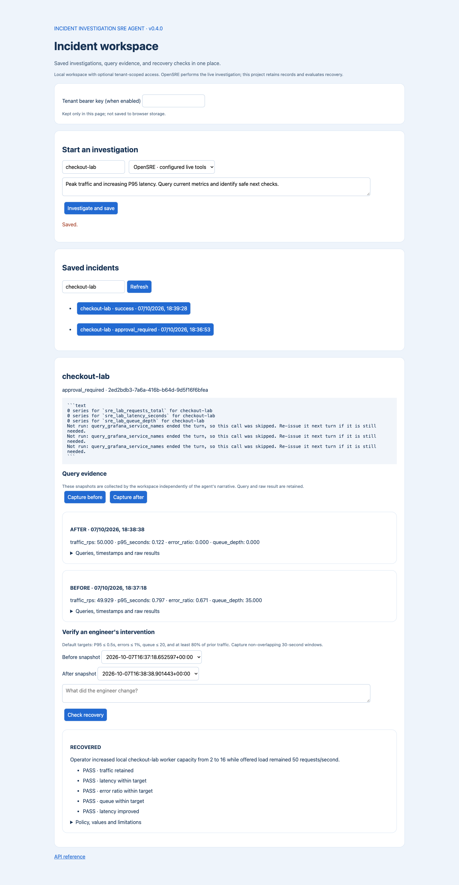
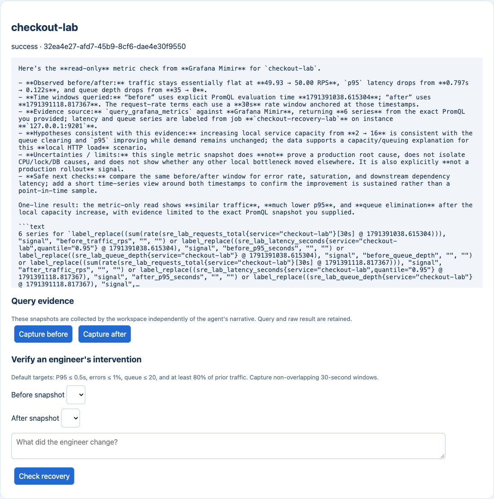

# Worker capacity: persistent investigation and measured recovery

[Project home](../../../README.md) · [Workspace setup](../../INCIDENT_WORKSPACE.md)

Recorded on **7 October 2026**, using project **0.4.0**, OpenSRE **2026.10.6**,
Azure-hosted **gpt-5.4**, Grafana **13.2.3**, and Prometheus **3.15.0**.

This case demonstrates this project's new responsibilities: retaining incident
records, preserving query evidence across a process restart, and verifying
recovery after an operator intervention. OpenSRE supplies the investigation
runtime. It is a controlled local workload, not a production deployment.

## What changed and what we measured

A load generator sent **50 real HTTP requests per second** to `checkout-lab`.
Two worker slots, each taking about 120ms, could not keep up. Requests queued,
and the service returned HTTP 500 when a request waited longer than 700ms.
The operator increased capacity from **2 to 16 slots** while offered load continued.
The service measured actual request outcomes, durations and waiting requests;
it did not switch between scripted metric values or auto-recover on a timer.

| Signal | Before | After |
| --- | ---: | ---: |
| Completed request rate, including failures | 49.93 RPS | 50.00 RPS |
| P95 latency | 797ms | 122ms |
| Error ratio | 67.10% | 0% |
| Waiting requests | 35 | 0 |

The workspace returned **`recovered`**: all five checks passed, including the
40-RPS minimum, latency improvement, P95 ≤ 500ms, errors ≤ 1%, and queue ≤ 20.
Before and after captures are about 80 seconds apart; the 30-second measurement
windows do not overlap. P95 includes failed requests, not only successes.

[Exact policy and verdict](verification.json) · [Before query evidence](before.json) ·
[After query evidence](after.json) · [Operator intervention response](intervention.json)

## Persistence proof

The HTTP API saved the first investigation and a before observation. We stopped
and restarted its Uvicorn process with the same SQLite file, then fetched the
same incident ID. The returned investigation result and observation ID matched
before the capacity change. This was a real process restart, not just a page
reload. Tests separately verify that incomplete runs become `interrupted`.

[Restart check](restart-check.json) · [Retained incident record](workspace-record.json)

[Mobile view](screenshots/workspace-mobile.png)

## Agent findings and the blocked first attempt

The initial OpenSRE request tried service discovery and returned
`approval_required`, with `query_grafana_service_names` denied. Its zero-series
output did not establish that metrics were absent: the authenticated Grafana
proxy and independent workspace queries returned the actual observations.
That incomplete investigation remains saved. We did not grant the blocked tool
or convert its status to success.

A separate follow-up used only `query_grafana_metrics`, with explicit PromQL
matchers and the recorded before/after evaluation times. It returned `success`
and reported six series: traffic, P95 and queue for both windows. The agent
identified a capacity/queueing explanation consistent with the evidence, and
recommended checking error rate, saturation and downstream latency over time.
It did not claim a proven production root cause.

[Initial response](investigation.json) · [Follow-up request](followup-request.json) ·
[Unedited follow-up response](followup-investigation.json)

The response calls its tool source “Grafana Mimir”; the configured Grafana
 datasource here actually proxies the local Prometheus server. Workspace recovery
checks use direct Prometheus observations and do not depend on model wording.

## Reproduce

1. Follow the [workspace setup](../../INCIDENT_WORKSPACE.md), including existing
   OpenSRE/Azure credentials if using the live backend. Use one API process.
2. Start the workload: `uvicorn examples.recovery_service:app --host 127.0.0.1 --port 9201`.
3. Start Prometheus with a 2-second scrape of `127.0.0.1:9201`. Set
   `SRE_PROMETHEUS_URL` to that server. For a Docker deployment, use the host
   target in `docker/observability/prometheus.yml`; host reachability may require
   a host interface binding and appropriate firewall restrictions.
4. Connect Grafana to that Prometheus server and provision a Viewer token for
   OpenSRE's metrics datasource. See the [Grafana guide](../../GRAFANA_PROMETHEUS.md).
5. Run `python examples/recovery_load.py --seconds 600 --rps 50`. Wait at least
   35 seconds for a full measurement window. The service starts with two slots.
6. Run `python examples/run_workspace_proof.py`. When it announces that the
   before capture is saved, restart only the API with the same DB path within
   its 40-second pause. The script performs the capacity change, waits another
   40 seconds, captures after evidence, and checks recovery. Its default backend
   is OpenSRE; `--backend demo` tests persistence and recovery without a model,
   but does not demonstrate a live agent investigation.
7. Open `/workspace`, select the saved incident, and inspect the evidence and
   verdict. `examples/capture_workspace.py` recreates screenshots when the
   recorded IDs and local browser/API are available.

The proof script overwrites the case JSON files when replayed. Archive an existing
run before replay if you need to keep both. The targeted follow-up request is
retained separately and can be submitted to `POST /investigate`; timestamps refer
to this recording and must be updated for a new run.

Docker did not respond during this recording. We used checksum-verified official
standalone Grafana/Prometheus binaries on loopback ports **3001/9091**, the API
on **8010**, and the workload on **9201**. This is a fallback execution method,
not a successful verification of the Docker setup.

## Limits and next checks

The intervention is a real change to local service concurrency, not a cloud
scale-out or database repair. Two observation windows do not establish sustained
recovery or causation. Repeat the workload, retain longer time-series evidence,
and check dependencies before applying a similar change to production. The
investigation service did not execute the capacity change: the proof runner did
so explicitly as the operator.

Tenant record isolation was tested with two authenticated HTTP clients and an
API process restart ([results](tenant-isolation.json)); runtime credential selection
was checked separately in tests. This live recording used the default local workspace, not two live
tenant integrations. See [tenant operating boundaries](../../INCIDENT_WORKSPACE.md#optional-tenant-isolation).

References: [OpenSRE source](https://github.com/Tracer-Cloud/opensre),
[Prometheus query API](https://prometheus.io/docs/prometheus/latest/querying/api/),
[Grafana service accounts](https://grafana.com/docs/grafana/latest/administration/service-accounts/).
