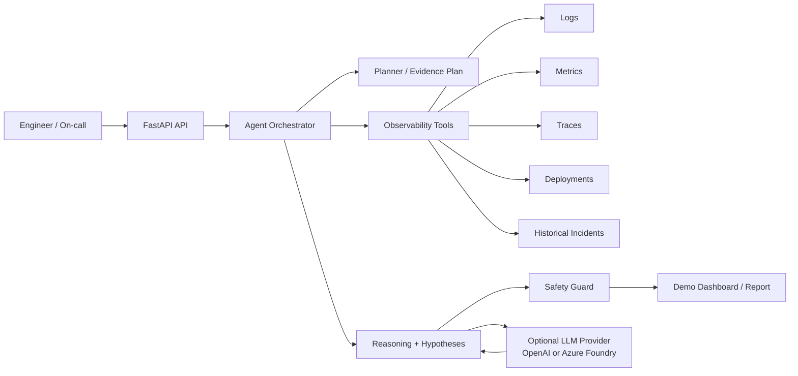
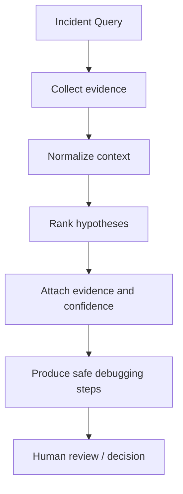
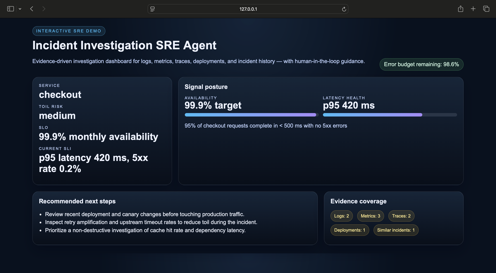

# Incident Investigation SRE Agent

An AI-assisted SRE investigation assistant that sits on top of observability signals and analyzes incidents like an experienced SRE engineer. It gathers logs, metrics, traces, deployments, and historical incidents, then produces evidence-backed hypotheses, confidence scores, and safe next debugging steps.

## Purpose

This agent is designed to help engineers investigate incidents faster while keeping humans fully in control. It is not a replacement for on-call judgment. Instead, it provides a structured incident context, highlights likely hypotheses, explains the reasoning trail, and recommends non-destructive investigation actions based on SLIs, SLOs, toil, and remaining error budget.

## What it does

- Collects mock observability context for a service and incident query.
- Normalizes logs, metrics, traces, deployments, and historical incidents into a single incident context.
- Produces ranked hypotheses with evidence, confidence scores, and safe next steps.
- Keeps humans in control through a clear human-in-the-loop design.

## What it does NOT do

- No autonomous remediation.
- No production write actions.
- No destructive operations.
- No hidden system prompts or black-box decisions.

## Human-in-the-loop philosophy

Every recommendation is explainable and traceable to the evidence the assistant collected. Engineers remain responsible for decision-making.

## Architecture

- FastAPI service in `app/main.py`
- Tool layer under `app/tools/` for logs, metrics, traces, deployments, incidents
- Reasoning and aggregation under `app/core/`
- Agent orchestration under `app/agent/`





## Demo observability source

A ready-to-run demo dataset is available in [examples/demo_observability.py](examples/demo_observability.py). It generates a realistic checkout-service context with:

- SLI and SLO framing
- error budget remaining percentage
- mock logs, metrics, traces, deployment, and incident evidence
- recommendations that account for toil and error budget pressure

Run it with:

```bash
python examples/demo_observability.py
python examples/demo_observability.py --write-json
```

The second command writes a JSON artifact to [examples/demo_observability_output.json](examples/demo_observability_output.json) for manual inspection or demo playback.

You can also render a simple dashboard-style summary with:

```bash
python examples/dashboard_demo.py
```

For a more polished, interactive demo experience, run:

```bash
python examples/dashboard_app.py
```

Then open http://127.0.0.1:8001/ to view a professional dashboard with SLI/SLO posture, error-budget, toil-risk, evidence coverage, and investigation guidance.

Example dashboard preview:



## Example scenario

> "Checkout service latency increased significantly"

## More real-world use cases

This agent is useful beyond a single latency spike. Example scenarios include:

- post-deployment validation for canary or blue/green rollouts
- correlating a customer-facing SLO breach with recent dependency changes
- triaging high error-rate incidents across payments, inventory, or search services
- helping on-call engineers classify incidents by impact, toil, and confidence
- surfacing historical incident patterns that accelerate investigation during weekends or handoffs
- acting as a reasoning companion for incident commanders who must maintain a clear evidence trail

## A path to a multi-agent SRE system

The current single orchestrator can grow into a multi-agent system without changing the safety model:

- Incident Planner Agent: turns an incident description into an investigation plan and evidence checklist
- Evidence Collector Agent: queries logs, metrics, traces, and deployment events
- Hypothesis Agent: ranks likely causes and explains confidence
- SLI/SLO Agent: checks service posture, error budget, and risk to customer experience
- Human Review Agent: presents a concise summary for the engineer to approve or reject

This architecture keeps the benefits of specialization while still preserving a single human-in-the-loop decision point.

## How MCP servers fit in

Model Context Protocol (MCP) servers can extend this agent by exposing structured tools and contextual connectors, for example:

- a Prometheus or Grafana MCP bridge for metrics and dashboards
- a Loki / OpenSearch / Datadog MCP server for logs
- an OpenTelemetry or Jaeger MCP bridge for traces
- a GitHub / CI/CD MCP connector for deployment events and release metadata
- a knowledge-base MCP connector for internal runbooks and past incidents

Using MCP would let the agent plug into existing enterprise tools through a standard interface while keeping the reasoning layer reusable and easier to test.

The assistant will inspect the demo observability dataset, identify likely hypotheses such as a deployment regression, retry amplification, or dependency timeout, and return a structured report with confidence scores, SLI/SLO context, and safe investigation steps.

## SLI / SLO and error budget reasoning

The assistant is designed to reason over the following SRE signals:

- SLI: what is being measured (availability, latency, correctness)
- SLO: the target reliability commitment for the service
- Error budget: how much unreliability is still allowed before the service is considered outside its target policy
- Toil: how much investigation effort or repeated manual work the current incident path may create

This matters because a high-confidence hypothesis should not only match the evidence but should also align with the current SLI/SLO posture and the remaining error budget. Recommendations are intentionally non-destructive and are framed as debugging or investigation guidance, not remediation or production changes.

## Optional LLM integration (OpenAI / Azure Foundry)

The agent can optionally use an external model for richer reasoning. The default path remains the deterministic, low-cost mock mode so demos and tests work without API keys.

### 1. Configure credentials

Copy `.env.example` to `.env` and set one of the following:

- OpenAI:
  - `LLM_PROVIDER=openai`
  - `LLM_MODEL=gpt-4o-mini`
  - `OPENAI_API_KEY=...`
- Azure AI Foundry / Azure OpenAI:
  - `LLM_PROVIDER=azure`
  - `LLM_MODEL=<your deployment name>`
  - `AZURE_OPENAI_API_KEY=...`
  - `AZURE_OPENAI_ENDPOINT=https://<resource>.openai.azure.com/`

Other controls:

- `LLM_TEMPERATURE=0.2` for more stable and cheaper reasoning
- `USE_REASONING_CACHE=true` to avoid repeating evidence summaries
- `MAX_INPUT_TOKENS=1200` to cap input size and reduce cost

### 2. Install the optional LLM package

```bash
pip install -e '.[llm]'
```

### 3. Run with real reasoning

Set the environment variables in your shell or `.env` and start the API as usual:

```bash
uvicorn app.main:app --reload
```

## How we reduce LLM cost

The implementation favors low-token, high-signal prompting:

- compact prompt assembly (no full raw payload dump)
- evidence trimming before the call
- token budget caps via `MAX_INPUT_TOKENS`
- optional caching of repeated reasoning context
- default to the mock mode when no credentials are present
- use compact models such as `gpt-4o-mini` first for investigation summaries

This keeps the system affordable for demos and internal use while still allowing a real LLM path when needed.

## Local run

1. `python -m venv .venv`
2. `source .venv/bin/activate`
3. `pip install -e .[test]`
4. `python examples/demo_observability.py`
5. `uvicorn app.main:app --reload`

Then open `http://localhost:8000/docs`.

## Example request

```bash
curl -X POST http://localhost:8000/investigate \
  -H 'Content-Type: application/json' \
  -d '{"service":"checkout","description":"Checkout service latency increased significantly"}'
```

## Docker

You can also spin up the service with Docker:

```bash
docker compose -f docker/docker-compose.yml up --build
```

## Testing

```bash
pytest
```

## Safety and human-in-the-loop design

This tool is intentionally limited to:

- evidence collection
- hypothesis generation
- explanation of confidence and evidence
- safe debugging recommendations

It does not:

- auto-remediate
- execute production changes
- delete or mutate infrastructure
- hide the evidence behind a black box
